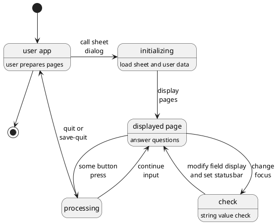
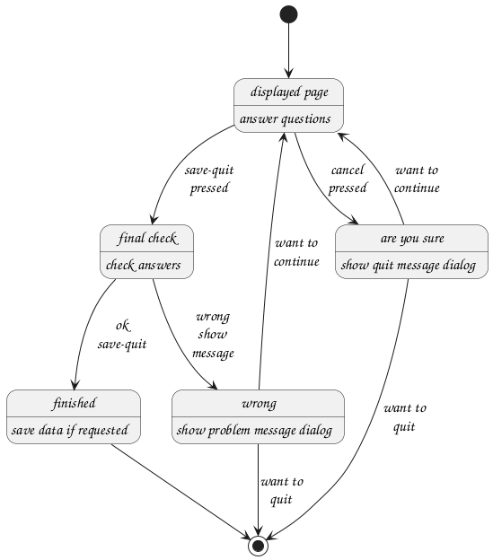
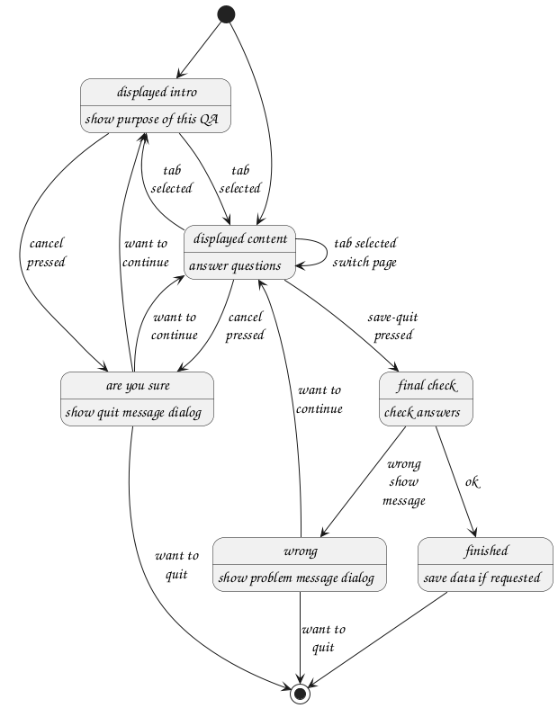

[toc]

# Packages

Basically there are two packages made for the questions and answer system. The first, called **QA**, is meant to define the primary modules which helps the user to load a questionare and displays it on screen. The resulting answers are returned and optionally saved in the applications environment. The other package, **QA::Manager** helps the user to describe a questionaire and to save it for use in an application.

## QA

## QA::Manager

### Management of QA sheets.

The created sheets are stored in some configuration environment of the QA::Manager. To create sheets, the QA::Manager needs to ask questions like a name and description and also the questions to pose to the user of the sheet. For this, the program has some sheets of its own to present the forms to create the sheets for the users application.

A sheet or form can be represented as a Notebook, Stack or an Assistant. On such a sheet you can find different items depending of the implementation. For example a Stack shows everything on one page and a Notebook or Assistent on several pages.

A description of the sheet comes at the top or on the first page when there are mages like a Notebook or Assistant has. In a Stack, one or more sets are displayed. The sets are spread over several pages when a Notebook or Assistant is used.

A set displays a number of questions together with proper input fields. At the top a description explains the purpose of the questions or whatever.


All values can be checked for its type and definedness by several methods.

A QA sheet is presented and can be filled in. After pressing `Save Quit`, the QA sheet is checked against wrong input. When the input checks alright the dialog is removed from display and the result returned. If the input is in some way wrong (visual hints are already shown), a message dialog is displayed with the found problems.

# API

## Defining a question

* Create questions
```
my QAManager::Question $un .= new(:name<username>, :qa-data(%(...)));
$un.required = True;

my QAManager::Question $pw .= new(:name<password>, :qa-data(%(...)));
$un.required = True;
$un.encode = True;
```
TODO; Now questions hold only text. It should also be capable to display images and colors. This also goes for comboboxes, lists and several other input tools.

## Defining a set of questions

* Add questions to a set
```
my QAManager::Set $creds .= new(:name<credentials>);
$creds.add-question($un);
$creds.add-question($pw);
```

<!--
## Building a category(or archive) of sets

* Create a category, populate and save
```
my QAManager::Category $category .= new(:category('accounting'));
$category.add-set($creds);
$category.save;
```
* Remove a category
```
$category.remove
```
-->

## Building a sheet
* Create a sheet, populate and save
```
my QAManager::Sheet $sheet .= new(:sheet('login'));
$sheet.display = QADialog;
$sheet.add-page( :title<Login>, :description('MongoDB Server Login');
$sheet.add-set( :category<accounting>, :set<credentials>);
$sheet.save;
```
<!--
## Run QA Dialog
* Select a sheet and run invoice dialog
```
my $callback-handlers = class { method x ( ... ) { ... } }.new;
my QAManager $qam .= new;
my Hash $data = $qam.run-invoice( :sheet<Login>, :$callback-handlers, :!save);
if ?$data { ... }
```
-->

<!--
# QA Manager
Main display
* [x] Title
* [x] Menu
  * [x] File
    * [ ] Quit; Quit program. Test for edit in progress

  * [x] Sheet (visible when Sheets notebook page is selected)
    * [ ] New
    * [ ] Open
    * [ ] Save
    * [ ] Save As
    * [ ] Delete

  * [ ] Category (visible when Categories notebook page is selected)
    * [ ] Open
    * [ ] Close
    * [ ] Save
    * [ ] Delete

  * [x] Set (visible when Sets notebook page is selected)
    * [ ] New
    * [ ] Add QA
    * [ ] Delete QA
    * [ ] Save
    * [ ] Delete

  * [x] Help
    * [ ] Purpose
    * [ ] Index
    * [ ] About

* [x] Notebook pages
  * [x] Sheets
    * [ ] Display a TreeView using a TreeStore model of available sheets with pages and sets.

  * [x] Categories
    * [ ] Shows a list of categories on the left. The right side is for two set lists. In between the set lists there are two arrow buttons.
      When lists are filled using open from menu, a set can be selected and moved from one list to the other using the arrow buttons.
      * [ ] First open from menu displayes a list of sets on the left from a selected category.
      * [ ] Second open from menu displayes a list of sets on the right from a selected category.

      * [ ] Close from menu closes the selected category
      * [ ] Save from menu save the changes on disk
      * [ ] Delete from menu deletes the category

  * [x] Sets
    * [x] Display a TreeView using a TreeStore model of available categories with the defined sets and QA entries.
      * [ ] New will create a new set. A dialog is shown with specific set questions. After finishing the dialog, the set is inserted in the set list without QA entries.
      * [ ] Add QA will show a dialog where a QA entry can be specified. After closing the dialog, the entry will be visible in the tree view.
      * [ ] Select a QA entry and keyboard arrow up/down will move the QA entry up or down the list.
      * [ ] Select a QA entry and delete from menu will remove the QA entry.
      * [ ] Save the set in the category on disk with menu save.

* Dialogs
  * [ ] Display of a QA content with two buttons to cancel or save.
  * [ ] Message dialog for several informational messages or warnings with close button.
  * [ ] Dialog to show help content with close button.
  * [ ] About dialog to show the program info and version with close button.
-->


# Display and behavior of sheet types

All but the Assistant sheet type are displayed in a Dialog widget. In this widget there can be one of several possibilities to give a it a specific layout.

There is a possibility to name the buttons differently. This is done using a button map. Each key in this map has by default the same button label as its key but the first letter of each word uppercase and the rest lowercase. E.g. `:cancel<Cancel>` and `:save-quit<Save Quit>`. You might want to set `:cancel<Quit>` or `:save-quit<Login>`.

## Display grid of a question

* Grid row
  * Grid col 0 (QAQuestion): Label with question.
  * Grid col 1 (QARequired): Label with optional star (**\***) if answer is required.
  * Grid col 2 (QAAnswer): A structure wherein the input widget resides
    * Frame; border is made visible when multiple answers are set (repeatable). Its widget name will be set to the name of the question.
      * Grid; mostly one row. more rows when repeatable.
        * Grid col 0 (QACatColumn): A ComboBox when repeatable and selectlist are set.
        * Grid col 1 (QAInputColumn): An input widget. Its widget name is that of the questions name with the row number attached, separated by a colon (**:**).
        * Grid col 2 (QAButtonColumn): A + or - button to add a row or to delete the row. Only shown when repeatable is set.

## Behavior of any input sheet type

The diagram shows a displayed sheet state where some of the input fields can be checked for wrong or absent answers. A button press will move the situation to other states depending on the sheet display type. Some of the buttons will return to the input state.



## QADialog sheet type

 This is the simplest of cases. There will be no extra pages and if given a sheet with more than one page, it will only handle the first page and ignore the rest. The dialog shows two buttons; `Cancel` or `save-quit`.



## QANotebook sheet type

A QANotebook has more pages selectable by tabs. There might be an introductory page with a description of the questionaire and no questions. There is only a `Cancel` button on an intro-page. Other buttons are disabled or invisible. The pages with questions have a `Cancel` and a `save-quit` button.



# UML Diagrams

## Overall view
```plantuml
scale 0.9
skinparam packageStyle rectangle
skinparam stereotypeCBackgroundColor #80ffff
set namespaceSeparator ::
hide empty members

'Class and interface decorations
Interface QA::Gui::PageTools <Interface>
class QA::Gui::PageTools <<(R,#80ffff)>>

'Connections

UserApp *-up-> QA::Gui::PageSimpleDialog
QA::Gui::Dialog <|-- QA::Gui::PageSimpleDialog
QA::Gui::PageTools <|.. QA::Gui::PageSimpleDialog
Gnome::Gtk3::Dialog <|-- QA::Gui::Dialog

QA::Gui::PageSimpleDialog *-> "*" QA::Gui::Page
QA::Gui::Page *-> "*" QA::Gui::Set
QA::Gui::Set *-right-> "*" QA::Gui::Question
QA::Gui::Question *-right-> QA::Gui::InputWidget
```
The **QA::Gui::PageSimpleDialog** module can be replaced with **QA::Gui::SheetSimpleWindow** **QA::Gui::PageStackDialog**, **QA::Gui::SheetNotebook** or **QA::Gui::SheetAssistant** depending on the purpose of the questionaire.


## Input widget details
```plantuml
scale 0.9
skinparam packageStyle rectangle
skinparam stereotypeCBackgroundColor #80ffff
skinparam groupInheritance 2
set namespaceSeparator ::
hide empty members

'Class and interface decorations

Interface QA::Gui::Value <Interface>
class QA::Gui::Value <<(R,#80ffff)>> {
  +process-widget-input()
  +check-widget-value()
  +check-users-action()
  +run-users-action()
  +set-status-hint()
  +add-class()
  +remove-class()
  -adjust-user-data()
  {abstract} set-value()
  {abstract} create-widget()
'  {abstract} clear-value()
  {abstract} input-change-handler()
}

class QA::Gui::InputWidget {
  QA::Question $!question
  Hash $!user-data-set-part
'  Array $!values
  Gnome::Gtk3::Widget $!widget-object
  Array $!grid-row-data
  Gnome::Gtk3::Grid $!grid
  Bool $.faulty-state;

  !create-widget-object()
  !create-user-widget-object()
  !append-grid-row()
  !create-toolbutton()
  !create-combobox()
  !apply-values()

  add-row()
  delete-row()
  hide-tb-add()
}


class QA::Gui::AnInputWidget <input widget> {

}


class QA::Gui::Question {
  +Hash $.pages;
  +Hash $.sets;
  +Hash $.questions;
}

'Connections

QA::Gui::Value <|... QA::Gui::AnInputWidget
QA::Gui::Value --> QA::Gui::InputWidget
QA::Gui::Value ---> QA::Gui::Question
QA::Gui::Value -> "user-data"
QA::Gui::InputWidget *-up--> QA::Gui::AnInputWidget
QA::Gui::Question *-> QA::Gui::InputWidget
'QA::Gui::InputWidget *-> QA::Question: $!question
QA::Gui::Value --> QA::Question: $!question

QA::Gui::Question -UP-> "*" QA::Gui::Page: $.pages
QA::Gui::Page --> "*" QA::Gui::Set: $.sets
QA::Gui::Set -> "*" QA::Gui::Question: $.questions
'QA::Gui::Set "*" <-* QA::Gui::Question: $.sets
'QA::Gui::Question "*" <-* QA::Gui::Question

'QA::Gui::InputWidget -up--> QA::Gui::QACheckButton
'QA::Gui::InputWidget -up--> QA::Gui::QAComboBox
'QA::Gui::InputWidget -up--> QA::Gui::QAEntry
'QA::Gui::InputWidget -up--> QA::Gui::QAFileChooser
'QA::Gui::InputWidget -up--> QA::Gui::QAImage
'QA::Gui::InputWidget -up--> QA::Gui::QARadioButton
'QA::Gui::InputWidget -up--> QA::Gui::QASpinButton
'QA::Gui::InputWidget -up--> QA::Gui::QASwitch
'QA::Gui::InputWidget -up--> QA::Gui::QATextView

'QA::Gui::Value <|... QA::Gui::QACheckButton
'QA::Gui::Value <|... QA::Gui::QAComboBox
'QA::Gui::Value <|... QA::Gui::QAEntry
'QA::Gui::Value <|... QA::Gui::QAFileChooser
'QA::Gui::Value <|... QA::Gui::QAImage
'QA::Gui::Value <|... QA::Gui::QARadioButton
'QA::Gui::Value <|... QA::Gui::QASpinButton
'QA::Gui::Value <|... QA::Gui::QASwitch
'QA::Gui::Value <|... QA::Gui::QATextView
```
