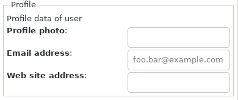

[toc]

# Packages

Basically there are two packages made for the questions and answer system. The first, called **QA**, is meant to define the primary modules which helps the user to load a questionare and displays it on screen. The resulting answers are returned and optionally saved in the applications environment. The other package, **QA::Manager** helps the user to describe a questionaire and to save it for use in an application.

## QA

## QA::Manager

### Management of QA sheets.

The created sheets are stored in some configuration environment of the QA::Manager. To create sheets, the QA::Manager needs to ask questions like a name and description and also the questions to pose to the user of the sheet. For this, the program has some sheets of its own to present the forms to create the sheets for the users application.

A sheet or form can be represented as a Notebook, Stack or an Assistant. On such a sheet you can find different items depending of the implementation. For example a Stack shows everything on one page and a Notebook or Assistent on several pages.

A description of the sheet comes at the top or on the first page when there are mages like a Notebook or Assistant has. In a Stack, one or more sets are displayed. The sets are spread over several pages when a Notebook or Assistant is used.

A set displays a number of questions together with proper input fields. At the top a description explains the purpose of the questions or whatever.


All values can be checked for its type and definedness by several methods.

A QA sheet is presented and can be filled in. After pressing Finish, the QA sheet is checked against wrong input. When the input checks alright the dialog is removed from display and the result returned. If the input is in some way wrong (visual hints are already shown), a message dialog is displayed with the found problems.

## Categories

To keep all sets in a single file would perhaps become unwieldy so it is decided to have sets in different files. The sets are then categorized by these files. E.g. All internet sets in an `internet.cfg` or specific sets about politics into `politics.cfg`. The category names would be `internet` and `politics` resp.

Directory where the set categories are stored will be `$*HOME/.config/QAManager/QAlib.d` on `*ux` systems. <!-- and `$*HOME/QAManager/QAlib.d` on Windows.-->

## Sheets

A complete QA sheet consists of a set of pages with one or more sets. Each page has a title and description.

Directory where the set sheets are stored will be `$*HOME/.config/QAManager/Sheets.d` on `*ux` systems. <!-- and `$*HOME/QAManager/Sheets` on Windows.-->

## Sets

A set groups a series of questions. A set has also a name and a short and long description. All texts can be specified in other languages as long the program can access it using an extension on a key.

Summarized
* Name
  * Used in Gui in a Frame widget. When absent, it takes the set key.
  * Referring to a set as a set key from other sets
* Description
  * Used in Gui to describe the use of a set of config settings. Empty when absent.
* key - value pairs
  * QA data. The data returned to the program using the library is a simple Hash with scalar values. The hash can have a hierargy.
  * The QA sets, maintained by the library, are more elaborate to describe the value.

## Key Value Pairs

### Keys
The key is a string of letters, digits or underscores.

Summarized
* Name; Used in Gui to retrieve the data. Name is set on the input widget.

### Values

Summarized
* Description; Used in Gui to describe the value needed. Empty when absent.
* Type; Number, String, Boolean, Image, Array, Set
  * Number; Int, Rat, Num
  * String; Text, Color, Filename
  * Array; Strings
* Limits, Boolean values like required, encode are `False` and visible is `True` if not mentioned. Default values are '' or 0 when absent. Min and Max are -Inf and Inf when absent. Encoding is using sha256 and stars means that the field will show stars instead of the text typed.
  * Numbers; Hash of required, default, minimum, maximum
  * String; Hash of required, default, encode, stars
  * Boolean; Hash of required, default
  * Image; Hash of required
  * Array; Hash of required
  * ?? Set; Hash of required, category name, set name
* Widget representation. Entry when absent. Each of the representations must show a clue as to whether the field is required. Default values must be filled in (light gray) when value is absent. When another set is referred, a button is placed to show a new dialog with the QA from that set. A boolean value displayed in a ComboBox has two entries with 'Yes' or 'No' as well as for two RadioButtons with 'Yes' or 'No' text.
  * Number; Entry, Scale
  * String; Entry, TextView, ComboBox
  * Boolean; ComboBox, RadioButton, CheckButton, Switch, ToggleButton
  * Image; FileChooserDialog, Drag and Drop
  * Color; ColorChooserDialog
  * File; FileChooserDialog, Drag and Drop
  * Array; ComboBox, CheckButton
  * Set; Button -> Dialog, 2nd page of a Stack or a NoteBook
* Checks on input.
* Repeatability of input fields; e.g. phone numbers
* Repeatability of sets; e.g. username/password sets for more than one account.

# Todo

## Sheet
* [x] create/load a sheet
* [x] save a sheet
* [x] delete a sheet
* [x] add a page
* [x] remove a page
* [x] add a set
* [x] remove a set
* [x] specify representation

* Representation of the sheet. The labels of the mentioned buttons can be changed using mappings in the sheet data but not their actions.
  * [ ] Assistant.
    * Complete input form with several pages.
    * Each page is viewable in a sidebar.
    * It can show more than one set of questions on each page.
    * It will show _Cancel_, _Next_, _Back_ or _Apply_ buttons.
    * The title of the page is shown in the sidebar.
    * The order through the pages is only from the first to the last page.
    * Buttons can select next or previous page.
    * Status of input fields can block the progress to the next page.
  * [x] NoteBook.
    * Complete input form with several pages.
    * Each page is selectable using tabs at the top.
    * It can show more than one set of questions on each page.
    * It will  how _Cancel_ or _Finish_ buttons.
    * The title of the page is shown in the tab.
    * Dialog has a status field at the bottom.
  * [ ] Stack.
  * [ ] Dialog.
    * Simple input form with only one page (the first if more in the sheet data).
    * It can show more than one set of questions on that page.
    * It will show _Cancel_ or _Finish_ buttons.
    * The description and title of the page is ignored.
    * Dialog has a status field at the bottom.

## Category
* Rethink the way that categories are made. Now several Sets are stored in a Category file. Why not store the sets in separate files placed in separate category directories. The Category did not held other information than the set data so that does not not need to account for. Checking for files in a directory might be easier.
* [x] create/load a category
* [x] save a category
* [x] delete a category
* [x] add a set
* [x] replace a set
* [ ] remove a set

## Set
* [x] create a set
* [x] add input field spec
* [ ] remove a field spec

## KV or field specification



#### Visual clues on validity of value

* [x] Stylesheet installed in resources
* [ ] Border color of entries are specified for faulty (red) and ok entries (green).
* [ ] A messagebox is shown on Finish if there are errors found. Finish will then not exit.

#### Field key specifications
* [ ] ?? button; Used to create another dialog
* [ ] callback; Method name in previously provided object. Used to check a value when there is text input.
* [ ] ?? cmpwith; Used to check a value against another field
* [x] default; Used to show a default value set in the input field.
* [x] description; Show text in front of the input field. By default it uses the title of the input field.
* [ ] encode; Used to encode the textual input with sha256.
* [x] example; Used to show an example value in the text input field. It is shown in light gray.

* [x] field; Specify the type of field. Default is QAEntry.
  * [x] QAEntry; Single line input for text and number. One or more values to get/set in user config.
  * [x] QAScale; Number input. One value to get/set in user config.
  * [x] QATextView; Multiline text input. One value to get/set in user config.
  * [x] QAComboBox; List selects for one selection. Values for list is provided in 'values'. One value to get/set in user config.
  * [x] QARadioButton; List selects for one selection.
  * [ ] QAList; List selects.
  * [x] QACheckButton; Boolean input. One or more values to get/set in user config.
  * [x] QASwitch; Boolean input.
  * [x] QAToggleButton; Boolean input.
  * [ ] QAFileChooserDialog. One or more values to get/set in user config.
  * [ ] QAColorChooserDialog
  * [x] QAImage. One or more values to get/set in user config.

  * [ ] ?? QADragAndDrop

* [x] height; Height in pixels. Used for e.g. a TextView.
* [x] invisible; Used to display text as invisible characters (\*)
* [ ] maximum; Used to define maximum for number type or maximum number of characters for string type.
* [ ] minimum; Used to define minimum for number type or minimum number of characters for string type.
* [x] name; Required. Used as a key in returned data along with category and set. Also used as a name on the widget to find the widget.
* [x] repeatable; Used to be able to repeat an input value when set True. Data must be stored in an array. To repeat, last field must show a **+** to the right to add a row and other fields must show **x** to delete those rows.
* [x] required; A boolean value used to show that input is required. It shows  star **\*** at the front of the input.
* [x] step; used in combination with maximum and minimum on QAScale.
* [x] title; By default it is the first character uppercased of the name.
* [x] tooltip; Used as a tooltip shown above input field
* [ ] values; An array of strings for (multi)select lists or comboboxes. Also text entries can have a combobox added to select a category for its input. For example <work home mobile> for telephone numbers.
* [ ] width; Used for width in pixels

#### Display

Dialogs are based on a sheet. There are dialog types specified with the sheet.

* [ ] QADialog. Plain dialog showing one set.
* [ ] QAStack. Dialog showing pages. Each page can have several sets.
* [x] QANoteBook. Dialog showing pages. Each page can have several sets.
* [ ] QAAssistant. Dialog showing pages. Each page has one set.

* Dialog buttons shown at the bottom
  * [x] cancel; close dialog and return nothing
  * [x] finish; close dialog and return data
  * [ ] next; to get to the next page when not a NoteBook
  * [ ] previous; to get to the previous page when not a NoteBook

#### Setting and getting values

Values are stored in users config environment (.config in Linux using freedesktop specs).

Example JSON Structure of the saved data entered in the dialogs;
```
{
  "QA Forms 1": {
    "profile": {
      "email": "dfgdf",
      "www": "",
      "image": "",
      "age18": true
    },
    "credentials": {
      "password": "dfg",
      "username": "adfg"
    }
  },
  "QA Forms 2": {
    "profile": {
      "image": "sfdg",
      "email": "",
      "www": ""
    }
  }
}
```
##### The keys in the structure

* sheet name
  * set name
    * field name: field input

##### Field input

The field input is a structure which can be used in all types of fields

* Entry:
  * `[ $value, ]`             This supports single and repeated values.
  * `[ :$value($category), ]` This supports repeated values with combobox categories. `:repeatable` and `:values` are set as to fill a combobox
* CheckButton:
  * `[ $value, ]`             Checked values
* ComboBox
  * `$value`                  Single selection
  * `[ $value, ]`             Multi selection
* Image
  * `$value`                  Path to image
* List
  * `$value`                  Single selection
  * `[ $value, ]`             Multi selection
* RadioButton
  * `$value`                  The one selected in the group
* Scale
  * `$value`                  The value set in the scale
* Switch
  * `$value`                  True or False
* TextView
  * `$value`                  Text
* ToggleButton
  * `$value`                  True or False


### A table where field specs are shown for each field type

| Symbol | Explanation
|--------|-------------------------------------------|
|!       | Must be provided with used type
|o       | Optional
|        | Cannot be used and is ignored

| Type          | Used letter in table
|---------------|------------------------------------|
| Entry         | E
| CheckButton   | h
| ComboBox      | o
| Image         | I
| List          | L
| RadioButton   | R
| Scale         | c
| Switch        | w
| TextView      | x
| ToggleButton  | g

|             |E|h|o|I|L|R|c|w|x|g|
|-------------|-|-|-|-|-|-|-|-|-|-|
|button       | | | | | | | | | | |
|callback     |o| | | | | | | | | |
|cmpwith      |o| | | | | | | | | |
|default      |o|o|o|o|o|o|o|o|o|o|
|description  |o|o|o|o|o|o|o|o|o|o|
|encode       |o| | | | | | | | | |
|example      |o| | | | | | | | | |
|field        |o|!|!|!|!|!|!|!|!|!|
|height       | | | |o| | | | |o| |
|invisible    |o| | | | | | | | | |
|maximum      |o| | | | | |!| | | |
|minimum      |o| | | | | |!| | | |
|name         |!|!|!|!|!|!|!|!|!|!|
|repeatable   |o| | |o| | | | |o| |
|required     |o| |o|o|o|o| | |o| |
|step         | | | | | | |!| | | |
|title        |o|o|o|o|o|o|o|o|o|o|
|tooltip      |o|o|o|o|o|o|o|o|o|o|
|values       |o|!|!| |!|!| | | | |
|width        | | | |o| | | | | | |
|-------------|--|--|--|--|--|--|--|--|--|--|
|display      |🗸
|set value    |🗸
|get value    |

# Interactions

Below diagrams show the interactions between user, user programs, the QA Manager program and library and the flow of QA sheets and config data.

##### Steps to define categories (part 1)
* The user interacts with the QAManager program to edit sets.
* The sets are stored in the library as categories.

##### Steps to define sheets (part 2)
* The user interacts with the QAManager program to edit sheets. Sets are selected from categories.
* The sheets are stored in the QAManagers sheets directory.

##### Steps to run the sheets (part 3)
* The user program asks for the sheets from the QAManagers program library.
* The library presents the QA to the user.
* After finishing, the data from the QA is stored in the programs environment.
* Then the user program can use the data to control its behavior, layout or whatever is defined.

```plantuml
!include <tupadr3/common>
!include <tupadr3/font-awesome/archive>
!include <tupadr3/font-awesome/clone>
!include <tupadr3/font-awesome/cogs>
!include <tupadr3/font-awesome/edit>
!include <tupadr3/font-awesome/female>

title Define Categories (part 1)

FA_ARCHIVE( qaa, Category\nLibrary) #ffefaf
FA_CLONE( ucs1, sets) #e0e0ff
FA_EDIT( ec2, edit set) #e0e0ff

FA_FEMALE( u1, user) #efffef

FA_COGS( qamp, QA Manager\nprogram)
FA_COGS( qaml, QA Manager\nlibrary)

u1 -> qamp
u1 <--> ec2
qamp <--> ec2

qamp <-> qaml
qaml <-> ucs1
ucs1 <-> qaa
```

```plantuml
!include <tupadr3/common>
!include <tupadr3/font-awesome/archive>
!include <tupadr3/font-awesome/clone>
!include <tupadr3/font-awesome/cogs>
!include <tupadr3/font-awesome/edit>
!include <tupadr3/font-awesome/female>
!include <tupadr3/font-awesome/file_code_o>

title Define QA sheets (part 2)

FA_ARCHIVE( qaa1, Category\nLibrary) #ffefaf
FA_ARCHIVE( qaa2, QA Sheets) #ffefaf
FA_CLONE( ucs2, sets) #e0e0ff
FA_CLONE( ucs3, sheets) #e0e0ff
FA_EDIT( ec2, edit sheet) #e0e0ff

FA_FEMALE( u1, user) #efffef

FA_COGS( qaml, QA Manager\nlibrary)
FA_COGS( qamp, QA Manager\nprogram)

u1 -> qamp
u1 <--> ec2
qamp <--> ec2

qamp <-> qaml
qaml <-> ucs3
ucs3 <-> qaa2

qaa1 -> ucs2
ucs2 --> qaml
```

```plantuml
!include <tupadr3/common>
!include <tupadr3/font-awesome/archive>
!include <tupadr3/font-awesome/clone>
!include <tupadr3/font-awesome/cogs>
!include <tupadr3/font-awesome/edit>
!include <tupadr3/font-awesome/female>
!include <tupadr3/font-awesome/file_code_o>

title Running QA sheets (part 3)

FA_ARCHIVE( qaa, QA sheets) #ffefaf
FA_CLONE( ucs2, sheets) #e0e0ff
FA_EDIT( ec1, edit\nsheet) #e0e0ff
FA_FILE_CODE_O( fc, config) #ffefaf

FA_FEMALE( u2, user) #efffef

FA_COGS( qaml, QA Manager\nlibrary)
FA_COGS( up, user\nprogram)

qaa -> ucs2
ucs2 -> qaml

qaml <--> up
qaml <--> ec1
up <- u2
u2 <-> ec1
qaml <--> fc

fc -> up
```

# API

## Defining a question

* Create questions
```
my QAManager::Question $un .= new(:name<username>, :qa-data(%(...)));
$un.required = True;

my QAManager::Question $pw .= new(:name<password>, :qa-data(%(...)));
$un.required = True;
$un.encode = True;
```

## Defining a set of questions

* Add questions to a set
```
my QAManager::Set $creds .= new(:name<credentials>);
$creds.add-question($un);
$creds.add-question($pw);
```

## Building a category(or archive) of sets

* Create a category, populate and save
```
my QAManager::Category $category .= new(:category('accounting'));
$category.add-set($creds);
$category.save;
```
* Remove a category
```
$category.remove
```

## Building a sheet
* Create a sheet, populate and save
```
my QAManager::Sheet $sheet .= new(:sheet('login'));
$sheet.display = QADialog;
$sheet.add-page( :title<Login>, :description('MongoDB Server Login');
$sheet.add-set( :category<accounting>, :set<credentials>);
$sheet.save;
```
<!--
## Run QA Dialog
* Select a sheet and run invoice dialog
```
my $callback-handlers = class { method x ( ... ) { ... } }.new;
my QAManager $qam .= new;
my Hash $data = $qam.run-invoice( :sheet<Login>, :$callback-handlers, :!save);
if ?$data { ... }
```
-->

<!--
# QA Manager
Main display
* [x] Title
* [x] Menu
  * [x] File
    * [ ] Quit; Quit program. Test for edit in progress

  * [x] Sheet (visible when Sheets notebook page is selected)
    * [ ] New
    * [ ] Open
    * [ ] Save
    * [ ] Save As
    * [ ] Delete

  * [ ] Category (visible when Categories notebook page is selected)
    * [ ] Open
    * [ ] Close
    * [ ] Save
    * [ ] Delete

  * [x] Set (visible when Sets notebook page is selected)
    * [ ] New
    * [ ] Add QA
    * [ ] Delete QA
    * [ ] Save
    * [ ] Delete

  * [x] Help
    * [ ] Purpose
    * [ ] Index
    * [ ] About

* [x] Notebook pages
  * [x] Sheets
    * [ ] Display a TreeView using a TreeStore model of available sheets with pages and sets.

  * [x] Categories
    * [ ] Shows a list of categories on the left. The right side is for two set lists. In between the set lists there are two arrow buttons.
      When lists are filled using open from menu, a set can be selected and moved from one list to the other using the arrow buttons.
      * [ ] First open from menu displayes a list of sets on the left from a selected category.
      * [ ] Second open from menu displayes a list of sets on the right from a selected category.

      * [ ] Close from menu closes the selected category
      * [ ] Save from menu save the changes on disk
      * [ ] Delete from menu deletes the category

  * [x] Sets
    * [x] Display a TreeView using a TreeStore model of available categories with the defined sets and QA entries.
      * [ ] New will create a new set. A dialog is shown with specific set questions. After finishing the dialog, the set is inserted in the set list without QA entries.
      * [ ] Add QA will show a dialog where a QA entry can be specified. After closing the dialog, the entry will be visible in the tree view.
      * [ ] Select a QA entry and keyboard arrow up/down will move the QA entry up or down the list.
      * [ ] Select a QA entry and delete from menu will remove the QA entry.
      * [ ] Save the set in the category on disk with menu save.

* Dialogs
  * [ ] Display of a QA content with two buttons to cancel or save.
  * [ ] Message dialog for several informational messages or warnings with close button.
  * [ ] Dialog to show help content with close button.
  * [ ] About dialog to show the program info and version with close button.
-->

# Display of sheets

All sheets are displayed in a Dialog widget. In this widget there can be one of several possibilities to give a it a specific layout.

* **Dialog**; This is the simplest of cases. There will be no extra layer. There will be no extra pages and if given a sheet with more than one page, it will only handle the first page and ignore the rest. Also it shows only two buttons. One to cancel and one to finish.

* **Notebook**; A notebook can show more pages, all of them displayed using tabs. There are only two buttons still, cancel and finish. The pages in the notebook are scrollable if large enough.

* **Stack**

* **Assistant**

There is a possibility to name the buttons differently. This is done using a button map. Each key in this map has by default the same button label as its key but the first letter in uppercase and the rest lowercase. E.g. `:cancel<Cancel>` and `:finish<Finish>`.

# Display of a question

* Grid row
  * Grid col 0 (QAQuestion): Label with question.
  * Grid col 1 (QARequired): Label with optional star (**\***) if answer is required.
  * Grid col 2 (QAAnswer): A structure wherein the input widget resides
    * Frame; border is made visible when multiple answers are set (repeatable). Its widget name will be set to the name of the question.
      * Grid; mostly one row. more rows when repeatable.
        * Grid col 0 (QACatColumn): A ComboBox when repeatable and selectlist are set.
        * Grid col 1 (QAInputColumn): An input widget. Its widget name is that of the questions name with the row number attached, separated by a colon (**:**).
        * Grid col 2 (QAButtonColumn): A + or - button to add a row or to delete the row. Only shown when repeatable is set.
