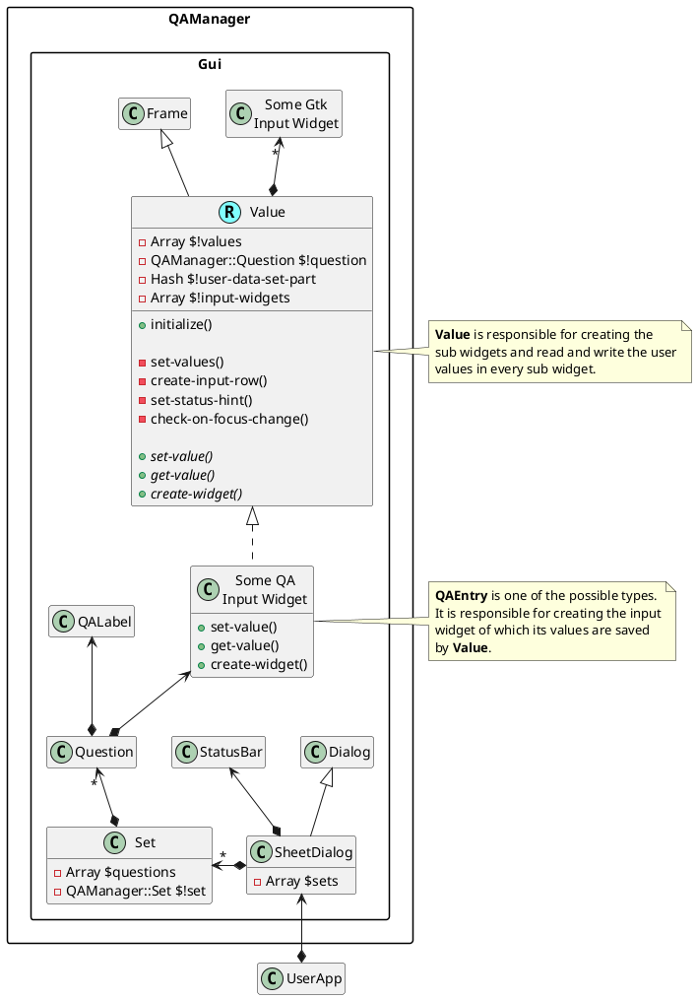

```plantuml
@startuml
'scale 0.9
skinparam packageStyle rectangle
skinparam stereotypeCBackgroundColor #80ffff
set namespaceSeparator ::
hide empty members

'class QAManager::Gui::Frame <<(R,#80ffff)>>
'class QAManager::Gui::Repeat <<(R,#80ffff)>>

class QAManager::Gui::Value <<(R,#80ffff)>> {
  +initialize()

  -set-values()
  -create-input-row()
  -set-status-hint()
  -check-on-focus-change()

  +{abstract} set-value()
  +{abstract} get-value()
'  +{abstract} check-value()
  +{abstract} create-widget()

  -Array $!values
  -QAManager::Question $!question
  -Hash $!user-data-set-part
  -Array $!input-widgets
}

note right of QAManager::Gui::Value : <b>Value</b> is responsible for creating the\nsub widgets and read and write the user\nvalues in every sub widget.

class "Some Gtk\nInput Widget" as QAManager::Gui::GtkIOWidget

class "Some QA\nInput Widget" as QAManager::Gui::QAIOWidget {
  +set-value()
  +get-value()
'  +check-value()
  +create-widget()
}

note right of QAManager::Gui::QAIOWidget : <b>QAEntry</b> is one of the possible types.\nIt is responsible for creating the input\nwidget of which its values are saved\nby <b>Value</b>.

class QAManager::Gui::Set {
  -Array $questions
  -QAManager::Set $!set
}

class QAManager::Gui::SheetDialog {
  -Array $sets
}


'QAManager::Gui::Set *--> QAManager::Set
'QAManager::Gui::Repeat <|.. QAManager::Gui::QAIOWidget

QAManager::Gui::Dialog <|-- QAManager::Gui::SheetDialog
QAManager::Gui::Set "*" <-* QAManager::Gui::SheetDialog
QAManager::Gui::SheetDialog <--* UserApp
QAManager::Gui::StatusBar <--* QAManager::Gui::SheetDialog

QAManager::Gui::Value <|.. QAManager::Gui::QAIOWidget
QAManager::Gui::Frame <|-- QAManager::Gui::Value
QAManager::Gui::GtkIOWidget "*" <--* QAManager::Gui::Value

QAManager::Gui::QAIOWidget <--* QAManager::Gui::Question
QAManager::Gui::QALabel <--* QAManager::Gui::Question

QAManager::Gui::Question "*" <--* QAManager::Gui::Set

@enduml
```
