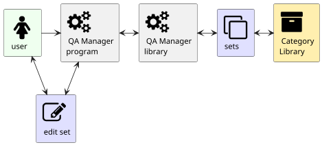

```plantuml
@startuml
scale 0.8

!include <tupadr3/common>
!include <tupadr3/font-awesome/archive>
!include <tupadr3/font-awesome/clone>
!include <tupadr3/font-awesome/cogs>
!include <tupadr3/font-awesome/edit>
!include <tupadr3/font-awesome/female>

'title Define Categories

FA_ARCHIVE( qaa, Category\nLibrary) #ffefaf
FA_CLONE( ucs1, sets) #e0e0ff
FA_EDIT( ec2, edit set) #e0e0ff

FA_FEMALE( u1, user) #efffef

FA_COGS( qamp, QA Manager\nprogram)
FA_COGS( qaml, QA Manager\nlibrary)

u1 -> qamp
u1 <--> ec2
qamp <--> ec2

qamp <-> qaml
qaml <-> ucs1
ucs1 <-> qaa
@enduml
```
