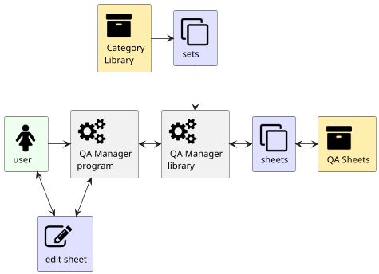

```plantuml
@startuml
scale 0.8

!include <tupadr3/common>
!include <tupadr3/font-awesome/archive>
!include <tupadr3/font-awesome/clone>
!include <tupadr3/font-awesome/cogs>
!include <tupadr3/font-awesome/edit>
!include <tupadr3/font-awesome/female>
!include <tupadr3/font-awesome/file_code_o>

'title Define QA sheets

FA_ARCHIVE( qaa1, Category\nLibrary) #ffefaf
FA_ARCHIVE( qaa2, QA Sheets) #ffefaf
FA_CLONE( ucs2, sets) #e0e0ff
FA_CLONE( ucs3, sheets) #e0e0ff
FA_EDIT( ec2, edit sheet) #e0e0ff

FA_FEMALE( u1, user) #efffef

FA_COGS( qaml, QA Manager\nlibrary)
FA_COGS( qamp, QA Manager\nprogram)

u1 -> qamp
u1 <--> ec2
qamp <--> ec2

qamp <-> qaml
qaml <-> ucs3
ucs3 <-> qaa2

qaa1 -> ucs2
ucs2 --> qaml
@enduml
```
