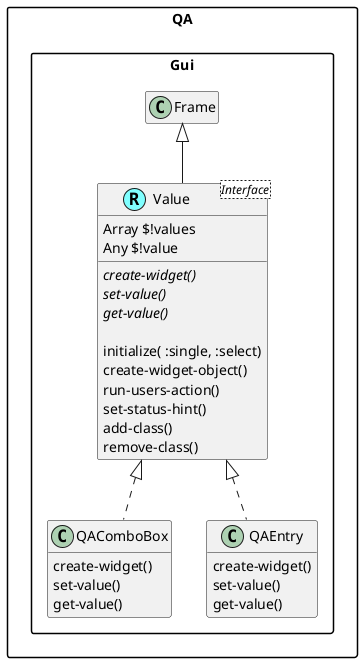

```plantuml
@startuml
'scale 0.9
skinparam packageStyle rectangle
skinparam stereotypeCBackgroundColor #80ffff
set namespaceSeparator ::
hide empty members


'classes and interfaces

Interface QA::Gui::Value <Interface>
class QA::Gui::Value <<(R,#80ffff)>> {
  Array $!values
  Any $!value

  {abstract} create-widget()
  {abstract} set-value()
  {abstract} get-value()

  initialize( :single, :select)
  create-widget-object()
  run-users-action()
  set-status-hint()
  add-class()
  remove-class()
}


class QA::Gui::QAComboBox {
  create-widget()
  set-value()
  get-value()
}

class QA::Gui::QAEntry {
  create-widget()
  set-value()
  get-value()
}


'connections

QA::Gui::Frame <|-- QA::Gui::Value
QA::Gui::Value <|.. QA::Gui::QAComboBox

QA::Gui::Value <|.. QA::Gui::QAEntry

@enduml
```
