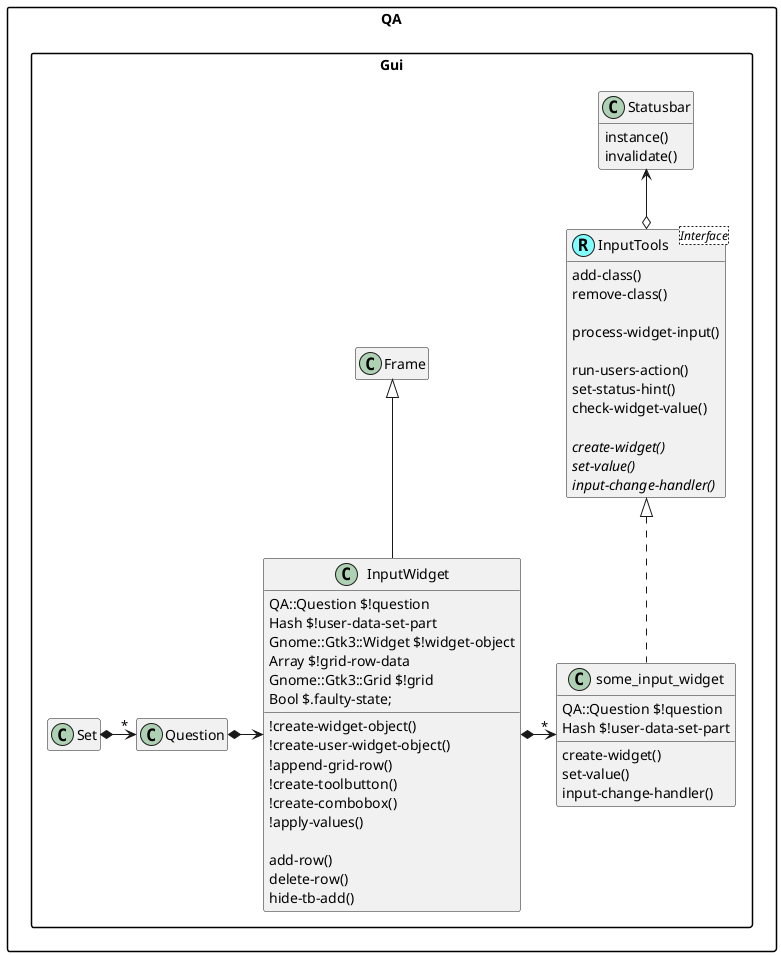

```plantuml
@startuml
'scale 0.9
skinparam packageStyle rectangle
skinparam stereotypeCBackgroundColor #80ffff
set namespaceSeparator ::
hide empty members

'-------------------------------------------------------------------------------
'Classes and interfaces

Interface QA::Gui::InputTools <Interface>
class QA::Gui::InputTools <<R,#80ffff>> {
  add-class()
  remove-class()

  process-widget-input()

  run-users-action()
  set-status-hint()
  check-widget-value()

  {abstract} create-widget()
  {abstract} set-value()
'  {abstract} get-value()
  {abstract} input-change-handler()
}

'Interface QA::Gui::InputWidget <Interface>
class QA::Gui::InputWidget {
  QA::Question $!question
  Hash $!user-data-set-part
'  Array $!values
  Gnome::Gtk3::Widget $!widget-object
  Array $!grid-row-data
  Gnome::Gtk3::Grid $!grid
  Bool $.faulty-state;

'  initialize()
  !create-widget-object()
  !create-user-widget-object()
  !append-grid-row()
  !create-toolbutton()
  !create-combobox()
  !apply-values()

  add-row()
  delete-row()
  hide-tb-add()
}


class QA::Gui::some_input_widget {
  QA::Question $!question
  Hash $!user-data-set-part

  create-widget()
  set-value()
'  get-value()
  input-change-handler()
}

class QA::Gui::Statusbar {
  instance()
  invalidate()
}

'-------------------------------------------------------------------------------
'Connections
QA::Gui::Set *-> "*" QA::Gui::Question
QA::Gui::Question *-> QA::Gui::InputWidget

QA::Gui::Frame <|-- QA::Gui::InputWidget
QA::Gui::InputWidget *-> "*" QA::Gui::some_input_widget
'QA::Gui::some_input_widget -> QA::Gui::InputWidget
QA::Gui::InputTools <|.. QA::Gui::some_input_widget

QA::Gui::Statusbar <--o QA::Gui::InputTools

'Gnome::Gtk3::Statusbar <|-- QA::Gui::Statusbar
'Gnome::Gtk3::Frame <|-- QA::Gui::Frame

@enduml
```
