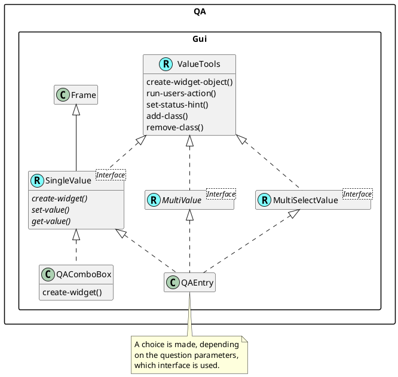

```plantuml
@startuml
'scale 0.9
skinparam packageStyle rectangle
skinparam stereotypeCBackgroundColor #80ffff
set namespaceSeparator ::
hide empty members


'classes and interfaces

Interface QA::Gui::SingleValue <Interface>
class QA::Gui::SingleValue <<(R,#80ffff)>> {
  {abstract} create-widget()
  {abstract} set-value()
  {abstract} get-value()
}

Interface QA::Gui::MultiValue <Interface>
class QA::Gui::MultiValue <<(R,#80ffff)>>

'Interface QA::Gui::SelectValue <Interface>
'class QA::Gui::SelectValue <<(R,#80ffff)>>

Interface QA::Gui::MultiSelectValue <Interface>
class QA::Gui::MultiSelectValue <<(R,#80ffff)>>

class QA::Gui::QAComboBox {
  create-widget()
}

Interface QA::Gui::MultiValue <Interface>
class QA::Gui::ValueTools <<(R,#80ffff)>> {
  create-widget-object()
  run-users-action()
  set-status-hint()
  add-class()
  remove-class()
}

'connections
QA::Gui::ValueTools <|.. QA::Gui::SingleValue
QA::Gui::ValueTools <|.. QA::Gui::MultiValue
'QA::Gui::ValueTools <|.. QA::Gui::SelectValue
QA::Gui::ValueTools <|.. QA::Gui::MultiSelectValue

QA::Gui::Frame <|-- QA::Gui::SingleValue
QA::Gui::SingleValue <|.. QA::Gui::QAComboBox

QA::Gui::SingleValue <|.. QA::Gui::QAEntry
QA::Gui::MultiValue <|.. QA::Gui::QAEntry
'QA::Gui::SelectValue <|.. QA::Gui::QAEntry
QA::Gui::MultiSelectValue <|.. QA::Gui::QAEntry
note bottom of QA::Gui::QAEntry: A choice is made, depending\non the question parameters,\nwhich interface is used.

@enduml
```
