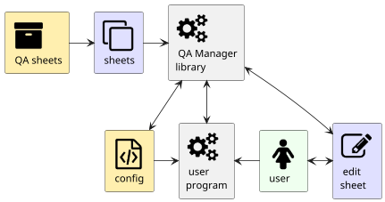

```plantuml
@startuml
scale 0.8

!include <tupadr3/common>
!include <tupadr3/font-awesome/archive>
!include <tupadr3/font-awesome/clone>
!include <tupadr3/font-awesome/cogs>
!include <tupadr3/font-awesome/edit>
!include <tupadr3/font-awesome/female>
!include <tupadr3/font-awesome/file_code_o>

'title Running QA sheets

FA_ARCHIVE( qaa, QA sheets) #ffefaf
FA_CLONE( ucs2, sheets) #e0e0ff
FA_EDIT( ec1, edit\nsheet) #e0e0ff
FA_FILE_CODE_O( fc, config) #ffefaf

FA_FEMALE( u2, user) #efffef

FA_COGS( qaml, QA Manager\nlibrary)
FA_COGS( up, user\nprogram)

qaa -> ucs2
ucs2 -> qaml

qaml <--> up
qaml <--> ec1
up <- u2
u2 <-> ec1
qaml <--> fc

fc -> up
@enduml
```
