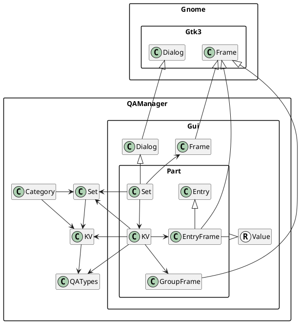

```plantuml
@startuml
'scale 0.9
skinparam packageStyle rectangle
set namespaceSeparator ::
hide members

'title the set demo dialog

QAManager::Category -> QAManager::Set
QAManager::Category --> QAManager::KV

QAManager::Set --> QAManager::KV

QAManager::KV --> QAManager::QATypes

Gnome::Gtk3::Dialog <|-- QAManager::Gui::Dialog
QAManager::Gui::Dialog <|-- QAManager::Gui::Part::Set

QAManager::Gui::Part::Set -> QAManager::Set
QAManager::Gui::Part::Set --> QAManager::Gui::Part::KV

QAManager::Gui::Frame <-- QAManager::Gui::Part::Set
Gnome::Gtk3::Frame <|-- QAManager::Gui::Frame

QAManager::Gui::Part::KV --> QAManager::QATypes
QAManager::Gui::Part::KV -> QAManager::KV
QAManager::Set <-- QAManager::Gui::Part::KV
QAManager::Gui::Part::KV --> QAManager::Gui::Part::GroupFrame
QAManager::Gui::Part::KV -> QAManager::Gui::Part::EntryFrame

Gnome::Gtk3::Frame <|----- QAManager::Gui::Part::GroupFrame
Gnome::Gtk3::Frame <|----- QAManager::Gui::Part::EntryFrame

class QAManager::Gui::Value <<(R,White)>>
'hide <<Role>> circle
QAManager::Gui::Part::EntryFrame -|> QAManager::Gui::Value

QAManager::Gui::Part::Entry <|-- QAManager::Gui::Part::EntryFrame

@enduml
```
