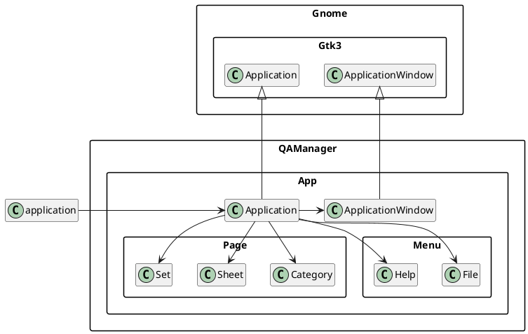

```plantuml
@startuml
'scale 0.9
skinparam packageStyle rectangle
set namespaceSeparator ::
hide members

'title top level application
application -> QAManager::App::Application

QAManager::App::Application -> QAManager::App::ApplicationWindow
QAManager::App::Application --> QAManager::App::Page::Category
QAManager::App::Application --> QAManager::App::Page::Sheet
QAManager::App::Application --> QAManager::App::Page::Set
Gnome::Gtk3::Application <|-- QAManager::App::Application

QAManager::App::Application --> QAManager::App::Menu::File
QAManager::App::Application --> QAManager::App::Menu::Help

Gnome::Gtk3::ApplicationWindow <|--- QAManager::App::ApplicationWindow

@enduml
```
