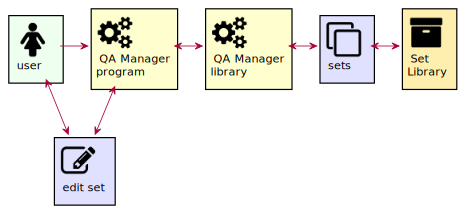

# Introduction

Questionnaires and configurations all have a series of questions and fields where you can fill in answers or values. Sometimes, questions are grouped around a subject or section. The way to display them can also vary. For example, several groups of questions can be shown on one page or displayed over several pages. The user can also be guided by an assistant. You see assistants more often e.g. when installing a software. This package tries to provide those for you.

There are 3 main tasks the package will provide
* Define `Set` libraries. A Set holds a number of questions and is stored in a file. Separate directories of sets can be managed by the user. An example directory name could be _Network_. The sets in that directory can be about server connections, user credentials or a user profile. This is a users configuration and storage task. The default however, is to have only one directory called `Sets` where the set files are stored.
  

* Define QA `questionnaires`. From the sets a questionnaire can be built. A `Sheet` can have one or more pages and each page can have one or more sets. The sheet is the final product which an application can use.
  

* Running QA sheets. When a questionnaire is defined, it can be retrieved and displayed by a user application. When the user hits some finish key, the answers to the questions can be checked and saved in the applications config environment.
  
