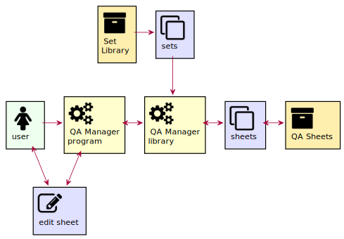

# Introduction

Questionnaires and configurations all have a series of questions and something where you can fill in answers or values. Sometimes, questions are grouped around a subject or section. The way to display them can also vary. For example, several groups of questions can be shown on one page or displayed over several pages. The user can also be guided by an assistant. You see assistants more often e.g. when installing a software. This package tries to provide those for you.

There are 3 main tasks the package will provide
* Define `Categories`. A number of sets holding questions will form a `Category`. Categories are like archives of sets around a subject. A `Set` is a series of questions. An example category could be _Network_. The sets in that category can be about server connections, user credentials or a user profile. This is a configuration and storage task.
  

* Define QA `Sheets`. From the categories, sets can be selected to build a questionaire. A `Sheet` can have one or more pages and each page can have one or more sets. The sheet is the final product which an application can use.
  

* Running QA sheets. When a questionaire is defined, it can be retrieved and displayed by a user application. When the user hits some finish key, the answers to the questions can be checked and saved in the applications config environment.
  
