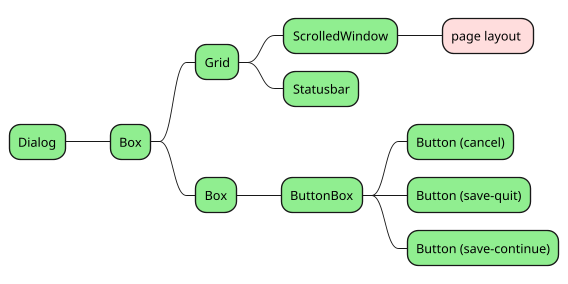
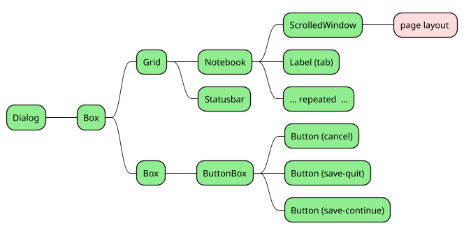
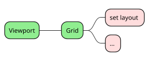
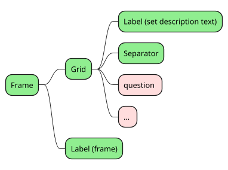
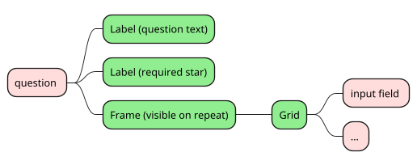
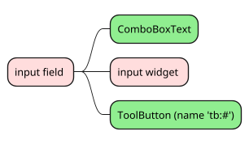
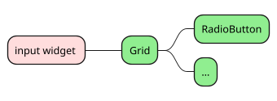
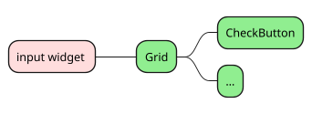
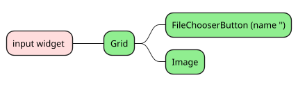

# Sheet Types

## Simple Sheet

## Notebook

## Stack

## Assistant

# Layout of a Sheet

## Page Layout

Each set is a row in the grid.

## Set Layout

A set is a framed grid of which the first row shows a descriptive text of the set. The second row is a separator. Then a series of questions follows in the remaining rows.

## Question
A question is a row in a grid. The input field is always framed but the frame is only visible when `$!question.repeatable` is turned on to group the input fields. In the frame there is a grid to contain the several input fields.

## Input Field
Each grid row contains a selection list if `$!question.selectlist` is valid, the input widget and a tool button when `$!question.repeatable` is on. The tool button shows a '+' and another button for a '-' on the last row to add a new row or to remove that row. Otherwise it shows a '-' to delete the row.

# Input widgets

Most input widgets are simple like `QAEntry`, `QASwitch` and `QAComboBoxText`. Only the more elaborate widgets are shown here.

## QARadioButton

The widget combines a series of radio buttons in a grid. The radio buttons are member of the same group

## QACheckButton

The widget combines a series of check buttons in a grid.

## QAImage

The widget a grid with a file chooser button and an image. Images from file managers can be dragged on the file chooser button. The image displays the result. When `$!question.dnd` is valid, the chooser button will not be visible. Multiple files can then be dragged upon an image or the empty image. The first images replaces the image where it is dropped, the rest is added to the list.

